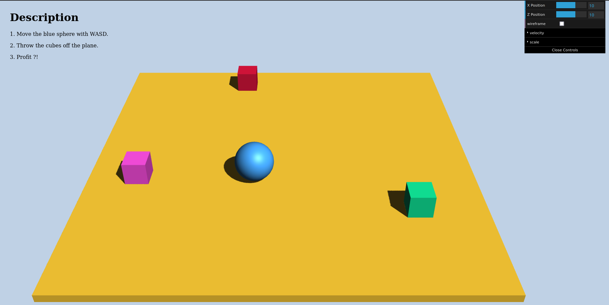

### Website 1
This project shows some basic information about me, displayed using simple html, css and js.

http://a1-tobias-mack.glitch.me

### Website 2
Implementation of a todo list via a simple Single Page Application.

http://a2-tobias-mack.glitch.me

### Website 3
Implementation of a todo list via a simple Fullstack Web Application.
Including Authentication, Persistence, Mobile Usability.

http://a3-tobias-mack.glitch.me/

https://a3-tobias-mack.onrender.com

### Website 4
This projects shows the use of basic components that are provided by Three.js.

http://a4-tobias-mack.glitch.me/

